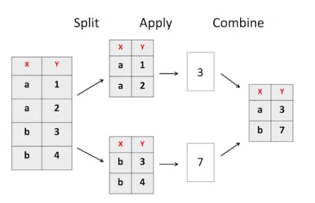

class: center, middle

.linea-superior[]
.linea-inferior[]


## Capacitación en R y herramientas de productividad

## Proyecto Estratégico Servicios Compartidos para la Producción Estadística

## Procesamiento de bases de datos (2)

### Mayo 2021

```{r setup, include=FALSE}
options(htmltools.dir.version = TRUE)
knitr::opts_chunk$set(message = FALSE) 
```

```{r xaringan-themer, include=FALSE, warning=FALSE}
library(xaringanthemer)
```

---

background-image: url("imagenes/fondo2.PNG")
background-size: contain;
background-position: 100% 0%

# Contenidos de hoy

Durante esta jornada continuaremos viendo funciones para la manipulación 
dataframes.

--

- Uso de funciones condicionales en la edición de datos (`if_else()`, 
`case_when()`).

--

- Funciones de agrupación (`group_by()`, `summarise()`).

--

- Tidy data (`pivot_longer()`, `pivot_wider()`).

---

background-image: url("imagenes/fondo2.PNG")
background-size: contain;
background-position: 100% 0%

# Breve resumen

En la sesión anterior vimos lo siguiente:

--

- Cómo importar dataframes de R, usando la función `load()`, y desde otras 
fuentes usando paquetes como: **`haven`**, **`readr`** y **`readxl`**.

--

- Cómo seleccionar variables dentro de un dataframe usando `select()`.

--

- Cómo renombrar variables dentro de un dataframe, utilizando `rename()`.

--

- Cómo filtrar variables de una dataframe, utilizando `filter()`. 

--

- Cómo ordenar las filas de un dataframe usando `arrange()`.

--

- Cómo editar y/o crear variables utilizando `mutate()`.

---

background-image: url("imagenes/fondo2.PNG")
background-size: contain;
background-position: 100% 0%

# Breve resumen

Vimos que todas estas funciones para manipulación de dataframes siguen una 
estructura similar. 

--

Cada una se comporta como un *verbo* y es posible 
conectar estas acciones con un operador llamado "**pipe**" (**%>%**).

--

También vimos que los pipes funcionan de la siguiente manera:

--

    1) Se selecciona un dataframe sobre el que se trabajará.
    
--

    2) Se ejecuta una acción sobre ese dataframe.
    
--

    3) Se obtiene un dataframe como resultado de la aplicación de la acción.


---

background-image: url("imagenes/fondo2.PNG")
background-size: contain;
background-position: 100% 0%

# Breve resumen

Un ejemplo: utilizando el siguiente dataframe...

```{r, warning=FALSE}
df <- data.frame(x1 = c(1, 2, 3, 4),
                 x2 = c("perro", "gato", "caballo", "conejo"))
print(df[1:2, ])
```

--

... crear una columna con el número de caracteres que tiene x2

...filtrar aquellos registros con más de 5 caracteres

...luego ordenar de manera descendente, según el número de caracteres

--

```{r}
library(dplyr)
df %>%
  mutate(n = nchar(x2)) %>% # nchar(), función utilizada para contar caracteres
  filter(n > 5) %>%
  arrange(desc(n))
```

---

background-image: url("imagenes/transformer.gif")
background-size: cover
class: center, bottom, inverse

# Transformación de datos (2)

---

background-image: url("imagenes/fondo2.PNG")
background-size: contain;
background-position: 100% 0%
  
# Uso de condicionales: if_else()
  
En la sesión anterior, conocimos la función `if_else()`, la cual se puede 
entender como: "*si sucede..., haz..., de otro modo, haz...*".

--

La función `if_else()`, considera un argumento específico para aquellas 
condiciones que no es posible evaluar si son *verdaderas* o *falsas* 
(valores missing).

--

```{r, warning=FALSE}
library(readr)
ene <- read_csv(file = "data/ene-2019-11.csv")
```

```{r, echo=FALSE}
ene <- ene %>%
  mutate(sexo_missing = if_else(row_number() <= 10, NA_real_, sexo))

```


```{r}
ene <- ene %>%
  mutate(glosa_sexo = if_else(sexo_missing == 1, "hombre", "mujer", "missing"))
table(ene$glosa_sexo)
```


---

background-image: url("imagenes/fondo2.PNG")
background-size: contain;
background-position: 100% 0%
  
# Uso de condicionales: if_else()
  

¿Podríamos usar `if_else()` para crear variables con más categorías?

--

Pensemos en 10 tramos de edad...


.center[

]


--

## Podemos usar varios `if_else()` consecutivamente


---

background-image: url("imagenes/fondo2.PNG")
background-size: contain;
background-position: 100% 0%
  
# Uso de condicionales: if_else()
  
Ejemplo: creación de tres tramos etarios: "menores a 15", "entre 15 y 30 años" 
y "mayores de 30 años".

--

```{r}
# Ejemplo: if_else consecutivos
ene <- ene %>%
  mutate(
    tramos_etarios = if_else(edad < 15,
                             "menores a 15",
                             ""),
    tramos_etarios = if_else(edad >= 15 & edad <= 30,
                             "entre 15 y 30 años",
                             tramos_etarios),
    tramos_etarios = if_else(edad > 30,
                             "mayores de 30 años",
                             tramos_etarios)
    )
```

--

```{r}
table(ene$tramos_etarios, useNA = "always")
```

---

background-image: url("imagenes/fondo2.PNG")
background-size: contain;
background-position: 100% 0%
  
# Uso de condicionales: if_else()
  
En cada paso, es necesario utilizar el valor previo

--

Si no se considera lo anterior, la variable creada no tendrá "historia".

--

### ¿Qué pasa si tenemos muchas categorías?

### ¿Podemos hacerlo mejor?

.center[

]


---

background-image: url("imagenes/fondo2.PNG")
background-size: contain;
background-position: 100% 0%
  
# Uso de condicionales: case_when()
  
Usando `case_when()`, el resultado anterior sería:

```{r}
# Ejemplo: método 2
ene <- ene %>%
  mutate(tramos_etarios3 = case_when(edad < 15               ~ "menores a 15",
                                     edad >= 15 & edad <= 30 ~ "entre 15 y 30 años",
                                     edad > 30               ~ "mayores de 30 años",
                                     TRUE                    ~ "fuera de rango")
    )
```

--

```{r}
table(ene$tramos_etarios3, useNA = "always")
```

---

background-image: url("imagenes/fondo2.PNG")
background-size: contain;
background-position: 100% 0%
  
# Uso de condicionales: case_when()
  
La función `case_when()` funciona de la siguiente manera:

--

```{r, eval=F}
dataframe %>%
  mutate(nv = case_when(cond_1 ~ valor_1,
                        cond_2 ~ valor_2))
```

--

Si la **primera condición es verdadera**, no se evalúa nada más

--

Si la **primera condición es falsa**, se evalúa la segunda

--

Si ninguna de las condiciones es verdadera, se asigna NA

---

background-image: url("imagenes/fondo2.PNG")
background-size: contain;
background-position: 100% 0%
  
# Uso de condicionales: case_when()

**IMPORTANTE**: 

--

- La *virgulilla* (~) tiene que ser utilizada entre la condición 
y el valor a asignar.

--

- El orden en el que programan las condiciones es importante.

    - Si la primera condición es verdadera, se asignará el primer valor y no 
    se evaluarán las siguientes condiciones.
    
--

- Los valores a asignar deben ser del mismo tipo

---

background-image: url("imagenes/fondo2.PNG")
background-size: contain;
background-position: 100% 0%
  
# Pequeño ejercicio
  
Utilizando la base de la ene y usando `case_when`, genera: 

- **tramos1**: valor 1 si la edad es mayor o igual a 0 y menor que 15, el valor 2 si 
la edad es mayor o igual a 15 y menor que 30, el valor 3 si la edad es mayor o igual a 30 y menor a 60 y 
el valor 4 si la edad es mayor o igual que 60.

Recuerda incluir una condición para los valores que puedan estar fuera del rango establecido y usa algún código distintivo para eso.

Luego, utilizando la función `table()`, observa cuántos registros están 
codificados por categoría para la variable "tramos1".


---

background-image: url("imagenes/fondo2.PNG")
background-size: contain;
background-position: 100% 0%
  
# Pequeño ejercicio
  
```{r}
ene <- ene %>%
  mutate(tramos1 = case_when(edad >= 0  & edad < 15 ~ 1,
                             edad >= 15 & edad < 30 ~ 2,
                             edad >= 30 & edad < 60 ~ 3,
                             edad >= 60             ~ 4,
                             TRUE                   ~ 999))
    
```

--

```{r}
table(ene$tramos1, useNA = "always")
```


--

**¿Qué pasa si la última condición se reemplaza por <= 200?**


```{r, eval=FALSE}

ene <- ene %>%
  mutate(tramos1 = case_when(edad >= 0  & edad < 15 ~ 1,
                             edad >= 15 & edad < 30 ~ 2,
                             edad >= 30 & edad < 60 ~ 3,
                             edad >= 60             ~ 4,
                             edad <= 200            ~ 5, #<< 
                             TRUE                   ~ 999))

```


---

background-image: url("imagenes/group_by_ungroup.png")
background-size: 100% 100%
class: center, bottom, inverse

# <font color = "blue">Agrupación de unidades</font>

---

background-image: url("imagenes/fondo2.PNG")
background-size: contain;
background-position: 100% 0%

# Agrupación de unidades

En la sesión anterior, vimos algunas funciones que se pueden utilizar en 
conjunto con `mutate()`:

--

- **min()**, **max()**: funciones que nos entregan los valores mínimos y 
máximos de una variable.

- **mean()**: función que nos entrega el promedio de los valores de una 
variable.

- **sum()**: función que nos entrega la suma de los valores de una variable.

- **n()**: función que nos entrega el número de registros de una variable.

--

¿Qué podríamos hacer si queremos obtener la edad media de las mujeres?


.center[

]


---

background-image: url("imagenes/fondo2.PNG")
background-size: contain;
background-position: 100% 0%

# Agrupación de unidades

Podríamos usar la función `filter()` y luego la función `mean()`

```{r, eval=FALSE}
ene <- ene %>% 
  filter(sexo == 1) %>% 
  mutate(media = mean(edad))

```


--

El paquete **`dplyr`** incluye una función llamada `group_by()`, la cual 
agrupa los registros según los valores de una o más variables.

--

Esta agrupación nos permite aplicar la misma función a todos los subconjuntos 
como si fuesen distintos dataframes.

---

background-image: url("imagenes/fondo2.PNG")
background-size: contain;
background-position: 100% 0%

# Agrupación de unidades

Gran parte del análisis de datos involucra la aplicación de una 
estrategia que en inglés se denomina *split-apply-combine*.

--
.small[
```{r}
ene <- ene %>%
  group_by(sexo) %>%
  mutate(n_sexo = n())
```
]

- Primero `group_by()` divide el *data frame*.

- Luego opera una función con los datos fragmentados.

- Finalmente, volvemos a combinar los resultados parciales.

--

.center[


]


---

background-image: url("imagenes/fondo2.PNG")
background-size: contain;
background-position: 100% 0%

# Agrupación de unidades

Número de hombres

.small[
```{r}
ene %>%
  filter(sexo == 1) %>% 
  select(sexo, n_sexo) %>% 
  slice(1:2)
```
]
--

Número de mujeres

.small[
```{r}
ene %>% 
  filter(sexo == 2) %>%
  select(sexo, n_sexo) %>% 
  slice(1:2)
```
]
---

background-image: url("imagenes/fondo2.PNG")
background-size: contain;
background-position: 100% 0%

# Paréntesis de slice

- Función auxiliar **`slice()`**

--

Como su nombre lo dice, esta función nos permite "cortar una rebanada" de un 
dataframe, es decir, extraer una porción de registros.

--

Se puede extraer un registro o un conjunto de registros.

--

Esta función se puede combinar con `group_by()`, y extraer un (o un conjunto) 
registro de cada grupo.


---

background-image: url("imagenes/fondo2.PNG")
background-size: contain;
background-position: 100% 0%

# Agrupación de unidades

Retomemos nuestro trabajo con `guaguas`

--

Utilizando la base de guaguas, obtener el nombre más utilizado en Chile en 
todos los tiempos

--


```{r, eval=FALSE}
library(guaguas)
guaguas %>%
  group_by(nombre) %>%
  mutate(total = sum(n)) %>%
  arrange(desc(total)) %>% 
  slice(1) #<<

```

- agrupar

- sumar las apariciones de cada nombre

- ordenar de mayor a menor

- cortar la primera fila

---
background-image: url("imagenes/fondo2.PNG")
background-size: contain;
background-position: 100% 0%

# Agrupación de unidades


```{r, echo=FALSE}
library(guaguas)
guaguas %>%
  group_by(nombre) %>%
  mutate(total = sum(n)) %>%
  arrange(desc(total)) %>% 
  slice(1)

```


.center[

]

---

background-image: url("imagenes/fondo2.PNG")
background-size: contain;
background-position: 100% 0%

# Agrupación de unidades

`group_by` sigue operando, hasta que se indique lo contrario 


```{r, eval=F}
guaguas %>%
  group_by(nombre) %>%
  mutate(total = sum(n)) %>% #<<
  arrange(desc(total)) %>% #<<
  slice(1) #<<

```


--

Si queremos realizar una operación no agrupada, luego de haber usado `group_by`,
debemos desagrupar con `ungroup`


---

background-image: url("imagenes/fondo2.PNG")
background-size: contain;
background-position: 100% 0%

# Agrupación de unidades

```{r}
guaguas %>%
  group_by(nombre) %>%
  mutate(total = sum(n)) %>%
  ungroup() %>%  #<<
  arrange(desc(total)) %>% 
  select(nombre, total) %>% 
  slice(1)


```

Ahora sabemos que el nombre más común desde que se tiene registros es María  🤓🤓🤓😄


---

background-image: url("imagenes/fondo2.PNG")
background-size: contain;
background-position: 100% 0%

# Ejercicio express

Utilizando la base de la ENE, creemos una columna llamada **media_edad** que contenga la media de edad en cada una de las regiones

--

```{r}
ene <- ene %>% 
  group_by(region) %>% 
  mutate(media_edad = mean(edad))
```


---

background-image: url("imagenes/fondo2.PNG")
background-size: contain;
background-position: 100% 0%

# Uso de summarise()


Un aliado natural de `group_by()` es `summarise()`.

--

Esta función permite resumir variables existentes en un dataframe.

--

En combinación con otras funciones, es una manera de tabular información.

--

.center[

]


---

background-image: url("imagenes/fondo2.PNG")
background-size: contain;
background-position: 100% 0%

# Uso de summarise()

Con la combinación de estas dos funciones podemos obtener un "cuadro de 
resumen".

--

Un ejemplo:

--

- Obtener el número de registros por región.

- Obtener el promedio de edad por región.

- Obtener la mediana de edad por región

---

background-image: url("imagenes/fondo2.PNG")
background-size: contain;
background-position: 100% 0%

# Uso de summarise()

```{r}
ene %>%
  group_by(region) %>%
  summarise(n = n(), promedio = mean(edad), mediana = median(edad))
```

---

background-image: url("imagenes/fondo2.PNG")
background-size: contain;
background-position: 100% 0%

# Ejercicio express

Construir un cuadro de resumen que incluya lo siguiente:

- Número de registros de la región de O'Higgins, por grupo ocupacional (b1).

--

```{r}
ene %>%
  filter(region == 6) %>%
  group_by(b1) %>%
  summarise(n = n())
```

---

background-image: url("https://www.openscapes.org/img/blog/tidydata/tidydata_1.jpg")
background-size: 100% 100%
class: center, bottom, inverse

---

background-image: url("imagenes/fondo2.PNG")
background-size: contain;
background-position: 100% 0%

# Tidy data

Es una forma de describir datos que están organizados con una **estructura rectangular**.

--

Es importante tener en consideración tres principios:

--

- Cada columna es una variable.

--

- Cada fila es una observación.

--

- Cada celda es un valor, o sea, la intersección entre una fila y una columna, 
entre variable y observación.

---

background-image: url("https://www.openscapes.org/img/blog/tidydata/tidydata_2.jpg")
background-size: 100% 100%
class: center, bottom, inverse

---

background-image: url("imagenes/fondo2.PNG")
background-size: contain;
background-position: 100% 0%

# Tidy data

Algunas características de estas datas son:

- Más eficiente para la ciencia de datos.

- Facilitan la colaboración.

- Mejoran la reproducibilidad.

--

El universo de **`tidyverse`** cuenta con un paquete llamado **`tidyr`**,  
que contiene funciones para implementar los conceptos de **tidy data**.

--

.center[

]

---

background-image: url("imagenes/fondo2.PNG")
background-size: contain;
background-position: 100% 0%

# Tidy data

.pull-left[


En esta sesión veremos dos funciones del paquete **tidyr**:

- **`pivot_wider()`**

Equivale a transponer un dataframe a formato horizontal.

- **`pivot_longer()`**

Equivale a transponer un dataframe a formato vertical.

]

.pull-right[


]

---

background-image: url("imagenes/fondo2.PNG")
background-size: contain;
background-position: 100% 0%

# Tidy data

## Función `pivot_wider()`

Esta función se utiliza para ordenar un dataframe de forma tal de mostrar 
categorías de una variable como columnas de un dataframe.

--

Incrementa el número de las columnas y disminuye el número de las filas.

--

Es útil para la presentación de cuadros de resumen con doble entrada.

--

```{r, eval=T, echo=FALSE}
library(tidyr)
ene %>%
  group_by(region, sexo) %>%
  summarise(n = n()) %>% 
  ungroup() %>% 
  slice(1:6) %>% 
  mutate(sexo = if_else(sexo == 1, "hombre", "mujer")) %>% 
  knitr::kable(format = "html")
```

---
background-image: url("imagenes/fondo2.PNG")
background-size: contain;
background-position: 100% 0%

# Tidy data

## Función `pivot_wider()`

```{r, echo=F, fig.align = "center"}
library(tidyr)
ene %>%
  group_by(region, sexo) %>%
  summarise(n = n()) %>%
  mutate(sexo = if_else(sexo == 1, "hombre", "mujer")) %>% 
  pivot_wider(names_from = sexo,
              values_from = n) %>% 
  ungroup() %>% 
  slice(1:3) %>% 
  knitr::kable(format = "html")
```


### Ahora vemos las categorías de sexo hacia la derecha

---
background-image: url("imagenes/fondo2.PNG")
background-size: contain;
background-position: 100% 0%

# Tidy data

## Función `pivot_wider()`


```{r echo=FALSE, fig.align = "center"}
ene %>%
  group_by(sexo, est_conyugal) %>%
  summarise(n = n()) %>% 
  knitr::kable(format = "html")


```

---
background-image: url("imagenes/fondo2.PNG")
background-size: contain;
background-position: 100% 0%

# Tidy data

## Función `pivot_wider()`


```{r echo=FALSE, fig.align = "center"}
ene %>% 
  group_by(sexo, est_conyugal) %>%
  summarise(n = n()) %>% 
  pivot_wider(names_from = est_conyugal, 
              values_from = n,
              names_prefix = "estado") %>% 
  knitr::kable(format = "html") 
  

```

### Pasamos de un formato largo a uno ancho


---

background-image: url("imagenes/fondo2.PNG")
background-size: contain;
background-position: 100% 0%

# Tidy data

## Función `pivot_wider()`


```{r, eval=F}
ene %>%
  group_by(region, sexo) %>%
  summarise(n = n()) %>%
  mutate(sexo = if_else(sexo == 1, "hombre", "mujer")) %>% 
  pivot_wider(names_from = sexo, #<<
              values_from = n) #<<

```

- *names_from*: categorías que se quiere convertir en columnas
- *values_from*: columna desde la cual extraer los valores

---

background-image: url("imagenes/fondo2.PNG")
background-size: contain;
background-position: 100% 0%

# Tidy data

En algunos casos, no contamos con una variable que contenga texto, para hacer el "pivoteo"

```{r, echo=F}
ene %>%
  group_by(region, sexo) %>%
  summarise(n = n())

```

--

En esos casos, podemos usar el parámetro **names_prefix**

```{r, eval=FALSE}
ene %>%
  group_by(region, sexo) %>%
  summarise(n = n()) %>%
  pivot_wider(names_from = sexo,
              values_from = n,
              names_prefix = "sexo" ) #<<
```

---

background-image: url("imagenes/fondo2.PNG")
background-size: contain;
background-position: 100% 0%

# Tidy data

Efecto de incluir **names_prefix**

```{r, echo=FALSE}
ene %>%
  group_by(region, sexo) %>%
  summarise(n = n()) %>%
  pivot_wider(names_from = sexo,
              values_from = n,
              names_prefix = "sexo" ) 

```


---

background-image: url("imagenes/fondo2.PNG")
background-size: contain;
background-position: 100% 0%

# Tidy data

## Función `pivot_longer()`

Esta función se puede considerar como la opuesta a `pivot_wider()`.

--

Esta función incrementa el número de filas y disminuye el número de columnas.

--

Los dataframes obtenidos por esta función son más fáciles de **manipular**, pero no de visualizar

--


--

Ejemplo de `pivot_longer()`:

--

```{r}
df1 <- data.frame(region = c(1, 2),
                  hombres = c(100, 200),
                  mujeres = c(50, 300))
df1
```


```{r,eval=F}
df1 %>%
  pivot_longer(cols = -region , names_to = "sexo", values_to = "total_sexo")
```

---

background-image: url("imagenes/fondo2.PNG")
background-size: contain;
background-position: 100% 0%

# Tidy data

## Función `pivot_longer()`

```{r,echo=F}
df1 %>%
  pivot_longer(cols = -region , names_to = "sexo", values_to = "total_sexo")
```

Los argumentos más comunes de esta función son:

--

- *cols*: columnas a las que se le aplicará la operación

--

- *names_to*: indica el nombre de la variable que será creada para "guardar" los
nombres de las categorías.


- *values_to*: indica el nombre de la variable que será 
creada para "guardar" los valores asociados a las categorías.

---

background-image: url("imagenes/fondo2.PNG")
background-size: contain;
background-position: 100% 0%

# Ejercicio express

Utilizando la base *ene*, calcule el número de registros según grupo 
ocupacional (b1), por mes (mes_encuesta).

Presente el resultado como un cuadro de resumen, con los grupos ocupacionales 
en las filas y los meses en las columnas.

---

background-image: url("imagenes/fondo2.PNG")
background-size: contain;
background-position: 100% 0%

# Ejercicio express

```{r}
ene %>%
  group_by(b1, mes_encuesta) %>%
  summarise(n = n()) %>%
  pivot_wider(names_from = mes_encuesta,
              names_prefix = "mes_",
              values_from = n)
```


---

background-image: url("imagenes/fondo2.PNG")
background-size: contain;
background-position: 100% 0%

# Ejercicios para la 🏠

- Importar la base **ene-2019-11.csv**. 

- Cree las siguientes variables:

    - **pet**: que tome valor 1 si edad es mayor o igual a 15, y 0 en otro 
    caso.
    
    - **ocu**: que tome el valor 1 si la variable cae_especifico se encuentra 
    en el rango (extremos incluidos) entre 1 y 7, y que tome el valor 0 en 
    cualquier otro caso.
    
- Genere un cuadro de resumen agrupado por región que muestre la suma de 
la variable **pet** y la suma de la variable **ocu**.

- Sobre el cuadro de resumen del punto anterior, cree la variable **tasa_ocup** por región, 
usando la siguiente expresión: **total de ocu / total de pet X 100**

(De esta forma se obtiene la tasa de ocupación, pero no será equivalente a 
la oficial, pues no se están considerando los factores de expansión).

- Usando las funciones de `tidyr`, genera un cuadro de resumen que muestre en las filas la categoría de rama 
de actividad económica (**b14_rev4cl_canes**) y en las columnas los grupos 
ocupacionales (**b1**).

---

background-image: url("imagenes/fondo2.PNG")
background-size: contain;
background-position: 100% 0%

# Referencias

Nada de esto sería posible sin:

- [`R fot Data Science, de Hadley Wickham`](https://r4ds.had.co.nz/)

- [`Advanced R, de Hadley Wickham`](http://adv-r.had.co.nz/Introduction.html)

- [`Data wrangling, exploration, and analysis with R, de Jenny Bryan`](https://stat545.com/index.html)

- [`Introduction to R, de Data Carpentry`](https://datacarpentry.org/R-genomics/01-intro-to-R.html#functions)

- [`Xaringan: Presentation Ninja, de Yihui Xie`](https://github.com/yihui/xaringan). Para generar esta presentación con la planilla ninja ⚔

R for Data Science tiene una traducción al español realizada por la comunidad hisp
ana de R:

- [`R para ciencia de datos, de Hadley Wickham`](https://es.r4ds.hadley.nz/)

---

class: center, middle

.linea-superior[]
.linea-inferior[]


## Capacitación en R y herramientas de productividad

## Proyecto Estratégico Servicios Compartidos para la Producción Estadística

## Procesamiento de bases de datos (2)

### Mayo 2021
